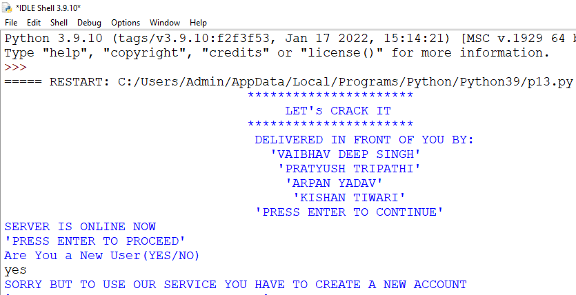
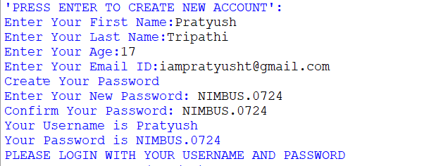
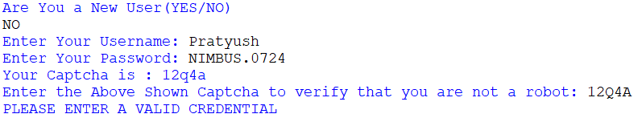
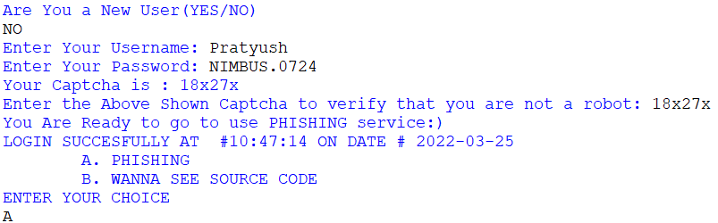
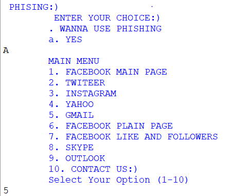
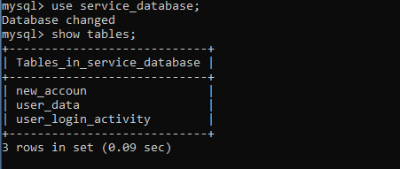
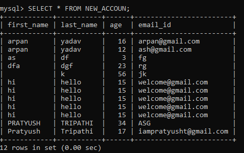
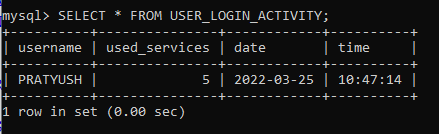
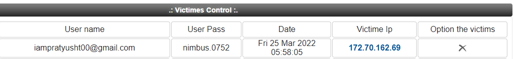

# Sample Output

## Python Output

### Creating a New Account of User:
- `Are you a New User(YES/NO)`

### Giving Record of New User:
- 

### If User Inputs Wrong Captcha:

### Login into Account with Right Captcha:

### Using Services of Phishing:

---

## MySQL Output

### Using Database ‘Service_database’:

- `mysql> use service_database;`
 - Database changed
- `mysql> show tables;`

### User Input Inserted into Tables in Database:

- `mysql> SELECT * FROM NEW_ACCOUN;`

### User Login Activity:

- `mysql> SELECT * FROM USER_LOGIN_ACTIVITY;`

---

## Phishing Link Output

### Phishing Link Output:

### User Credential from Phishing Link:

